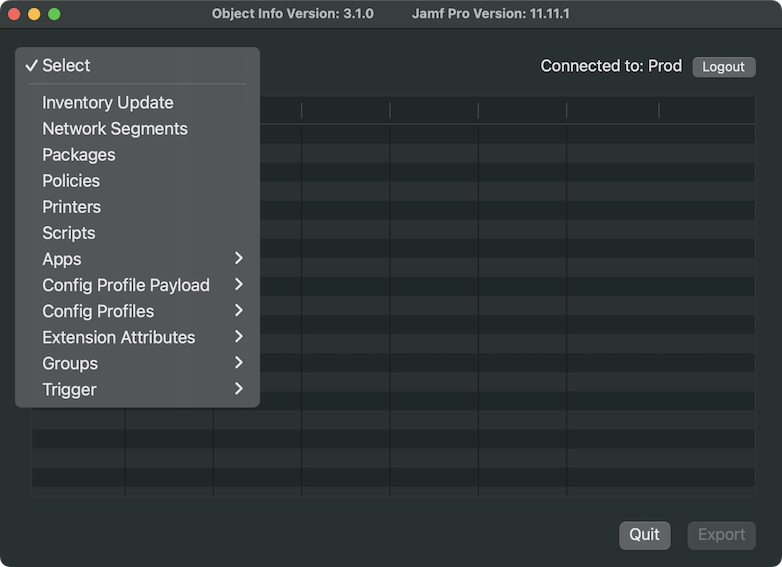

# Object Info

  
    

Wondering what packages or scripts are scoped to what policies?  Or what configuration profiles contain a certain payload?  Need an overview of all your network segments?  How about finding out what object(s) smart/static groups are attached to?  Object info looks to summarize these things and more.

Download: [Object Info](https://github.com/BIG-RAT/Object-Info/releases/latest/download/Object.Info.zip)

**Current Searches**:

* Find policies that update inventory.
* Find what triggers are used in what policies.
* Find IP range, default share name, and URL associated with a network segment.
* Find what policies and prestages a package is associated with.
* Find what policies and prestages a script is associated with.
* Find what policies, configuration profiles, and apps a computer group is associated with.
* Find what configuration profiles, and apps a device group is associated with.
* Find macOS configuration profiles containing a particular payload.
* Find iOS configuration profiles containing a particular payload.  
* Find where extension attributes (computer/mobile device) are used in groups and advanced searches along with the type of EA (script, pop-up, LDAP..).
	
Unused objects are not displayed.  For example, if a package is not used in either a policy or prestage it will not be listed.  Policies that are disabled can be identified with the text [disabled] displayed in the frequency column.

**History**

2024-09-27: Version 3.0.0 - Address issues 16, 19, and 20. Add login window and update UI.

2024-01-24: Version 2.0.2 - Fix issue with version lookup on Jamf Pro 11.

2023-07-14: Version 2.0.1 - Add scan of extension attributes in advanced searches display (issue #14).  Provide information if an EA is used in an advanced search for criteria and/or display.

2022-10-08: Version 2.0.0 - Additional details on various objects. Summary of policies and profiles that include scope, limitations, and exclusions - imitations and exclusions for LDAP user groups only. Extension attribute usage along with the type of attribute. PreStages are now scanned for profiles and packages.

2022-03-08: Version 1.5.2 - Resolve app hanging due to computerconfigurations being removed.

2022-01-08: Version 1.5.0 - Add execution frequency to update inventory and trigger searches.  Add option to view log folder under View menu.  For Jamf Pro 10.35 and later authenticate using a bearer token generated from the Jamf Pro API.

2021-12-15: Version 1.4.2 - Fixed issue where policy/script lookups may hang when computer configurations exist.  Added an alert in the event one or more lookups fail.

2021-11-27: Version 1.4.0 - Fixed issues with extension attribute and group lookups.  Added ability to report on policy trigger usage.

2021-10-17: Version 1.2.1 - Fixed crash due to login trigger being removed from Jamf Pro

2021-09-05: Version 1.2.0 - Added computer and mobile device extension attribute usage.  Scans groups and advanced device searches to see if they are used.

2021-06-17: Version 1.1.3 - Fix crash when config profile has no payload.

2021-01-14: Version 1.1.1 - Added ability to sort column results.  Fixed some issues where scoped objects were not listed.